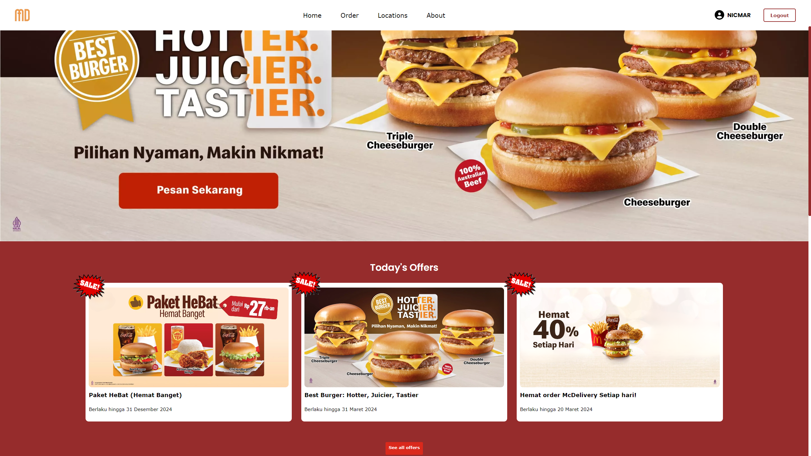
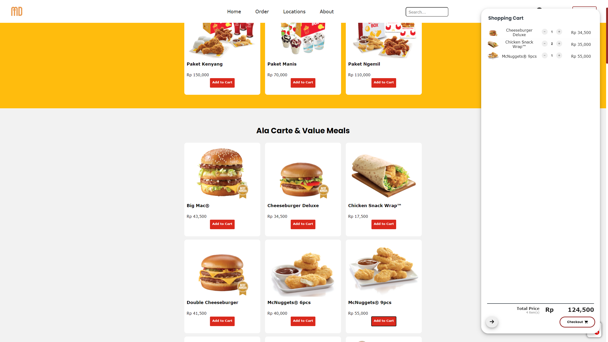
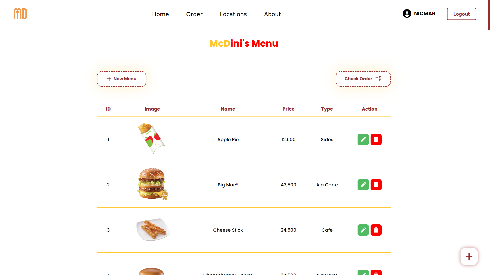

# self-ordering

Repository ini merupakan hasil dari Project Website dengan topik self-ordering atau pemesanan mandiri bertajuk "McDini". Project ini dibuat untuk memenuhi salah satu komponen nilai UTS mata kuliah Back-End Programming dengan dosen pengampu Bapak Irvan Lewenusa, S.Kom., M.Kom.

Project ini dikerjakan secara kolaboratif oleh sekelompok mahasiswa dari program studi Teknik Informatika, kelas E di mata kuliah Back-End Programming, namun kelas A untuk angkatan 2022 di FTI Untar.

Kelompok 4

| NAMA                | NIM       | Username GitHub    |
|---------------------|-----------|--------------------|
| Jason Permana       | 535220002 | Dzeisonov          |
| Arya Wira Kristanto | 535220004 | Awk2824            |
| Nicholas Martin     | 535220027 | Nicholas-Martin007 |
| Kevin Jonathan JM   | 535220038 | kvnidn             |

Kami mendapat inspirasi dari pengalaman dan konsep layanan McDonald's dalam mengembangkan proyek ini. Namun, penting untuk diketahui bahwa proyek ini hanya dibuat untuk kepentingan pembelajaran, dan kami tidak mengklaim kepemilikan atas merek atau aset yang ditampilkan dalam repository ini.

Akses video demo di YouTube [McDini Self-order Restaurant Website, Developed by FTI Untar Students!](https://youtu.be/voK1YMa73kk?si=5nTq-VwfU_3_5T-s)

Contoh Tampilan Website McDini:

Website can be run by running "npm run start"
This website will run on port 3000 (localhost:3000)

The menu data is available in public/data/data_menu.json
Make sure to put it in McDini database inside menus collection in MongoDB

Admin account can be created by adding field role: 'admin' manually in the document inside users collection or via code such as

const newAdmin = new User({
    username: 'admin',
    email: 'admin@mcdini.com',
    password: '12345',
    role: 'admin',
  });
  
newAdmin.save()
.then(admin => {
    console.log('New admin created:', admin);
})
.catch(err => {
    console.error('Error creating admin:', err);
});

The above admin account will be created automatically when the program starts.

You can login by entering

email: admin@mcdini.com
password: 12345

in the login popup.
